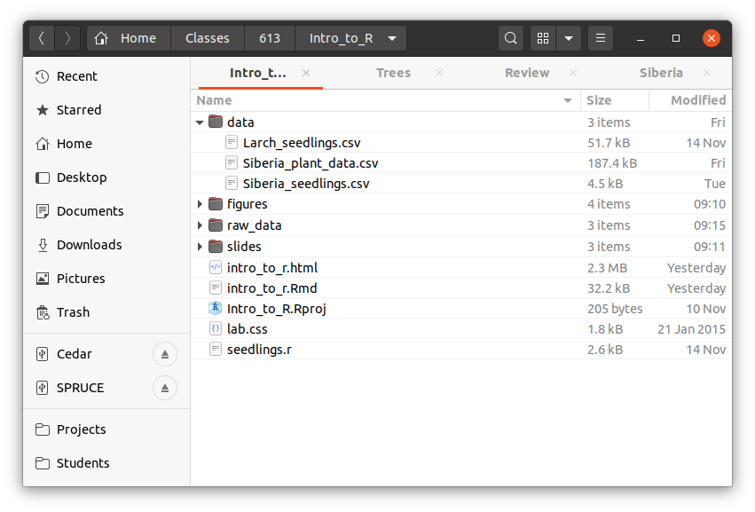

```{r setup, include=FALSE}
knitr::opts_chunk$set(echo = TRUE, eval = FALSE)
```

# Overview

The goal of this lab is to introduce you to exploring your data in R and RStudio, which you'll be using
throughout the course both to learn the statistical concepts and also to analyze real data.  To 
straighten out which is which: R is the name of the programming language
and RStudio is a convenient interface.

You are encouraged to explore beyond what the labs dictate;
a willingness to experiment will make you a much better data analyst.  

Today we begin with the fundamental building blocks of R and RStudio: the interface, 
reading in data, and basic commands.

When you start RStudio the first time, you will see something like this:


The window is split into three panels. Soon the left side of the window will grow another panel. Each panel has multiple tabs. 


The panel in the upper right shows your workspace - the data, variables and special functions that you are currently working with - in the *Environment* tab. The *History* tab lists the commands that you've previously entered.  

The lower right panel has a simple browser in the *Files* tab, displays graphics in the *Plots* tab, helps you install and load additional libraries of functions and data in the *Packages* tab, and lets you navigate the *Help* system.


The panel on the left is where the action happens.  The main tab shows the *Console*. The `>` is called the *prompt*.  The prompt is prompting you to type a command.  Initially, interacting with R is all about typing commands and interpreting the output. 


### The Console and entering commands

To get you started, enter the following commands at the R prompt (i.e. right after
`>` on the console).  You can either type them in manually or copy and paste them
from this document.

```{r}
2+3
2*3
2^3
sqrt(9)

# This is a comment. R will ignore any code preceded by a number sign. 
```

Two very important commands: `<-` is called "left assignment". Whatever is on the left of the arrow becomes a name you can use to refer to whatever is on the right of the arrow. `c()` stands for "concatenate" or maybe "combine". It makes a list of whatever is inside the parentheses.

```{r}
x <- c(1,3,2,5) # This makes a list with the numbers 1, 3, 2, 5 and calls it x. 
# Notice that x just appeared in your workspace in the upper right.
x # This reports the current value of x.
x+2 # You can do arithmetic to a list. This adds 2 to each element of x.
y <- c(4,2,-3,0) # Or you can make another list.
x+y # And add the two lists. 
```

R is a language for doing statistics, so of course, some of the first commands you will use are for basic statisitical computations.

```{r}
mean(x)
sum(x)
max(x)
min(x)
length(x)
```

We can redefine `x`, even in terms of the current value of `x`.

```{r}
x <- c(1,6,2) 
x
x <- x*2
x 
```

Any command or object that comes with R has a help file.  Type a question mark before something that you would like to know about. For example try `?mean`.

R can do matrix arithmetic too, but be careful to tell it what you want it to do. For matrix multiplication use `%*%` instead of `*`.
```{r}
x<-matrix(data=c(1,2,3,4), nrow=2, ncol=2)
x
x^2
x%*%x
```


R has many tools based on standard statistical distributions. For example, we can to generate data from assumptions about our variables.
```{r}
x<-runif(50) # Generate 50 random numbers from a uniform distribution.
y<-rnorm(50,mean=2*x+5,sd=.1) # Add Gaussian noise with sd=1. 
plot(y~x) # Show the data.
cor(x,y) # Correlation coefficient.
```


### R Packages

`R` is an open-source programming language, meaning that users can contribute packages that make our lives easier, and we can use them for free.
For this lab, and many others in the future, we will use the following:

-   The **tidyverse** "umbrella" package which houses a suite of many different `R` packages: for data wrangling and data visualization
-   The **emdbook** `R` package: for data and custom functions related to Bolker, Ecological Models and Data in R.

In the lower right hand corner click on the *Packages* tab.
Type the name of each of these packages (tidyverse, emdbook) into the search box to see if they have been installed.
If these packages do not appear when you type in their name, install them by copying and pasting or typing the following two lines of code into the console of your RStudio session.
Be sure to press enter/return after each line of code. The tidyverse umbrella package contains many other packages, so it may take a little while to install.

```{r install-packages, message = FALSE, eval = FALSE}
install.packages("tidyverse")
install.packages("emdbook")
```

After pressing enter/return, a stream of text will begin, communicating the process `R` is going through to install the package from the location you selected when you installed `R`.
If you were not prompted to select a server for downloading packages when you installed `R`, RStudio may prompt you to select a server from which to download; any of them will work.

You only need to *install* packages once, but you need to *load* them each time you relaunch RStudio.
We load packages with the `library` function.
Copy and paste or type the the following two lines in your console to load the tidyverse and emdbook packages into your working environment.

```{r load-packages, message = FALSE,eval=TRUE}
library(tidyverse)
library(emdbook)
```

We are choosing to use the tidyverse package because it consists of a set of packages necessary for different aspects of working with data, from loading data to wrangling data to visualizing data to analyzing data.
Additionally, these packages share common philosophies and are designed to work together.
You can find more about the packages in the tidyverse at [tidyverse.org](http://tidyverse.org/).


# R scripts

From the drop down menu in the upper left with the green + on a blank page, create a new R Script. This will give you a panel in the upper left of your RStudio window where you can input R commands. Unlike commands typed into the console, these commands will not be executed until you tell R to do so. 


In the upper right of your screen, choose the *History* tab and select some or all of the code you just entered. You can use Shift+Mouse to select multiple lines. Press the *To Source* button - you should see those lines you just entered appear in your script window. This is handy for when you are trying various things in the console and find some commands that you want to save. Since you only need to install packages once on your computer, you might want to delete the lines with the `install.packages` commands, or comment them out by putting a `#` at the beginning of each line.

You can run commands from your script by putting your cursor on the line that you would like to run and either clicking on the *Run* button in the upper right of the script window, or using *Control+Enter* (*Command+Enter* on a Mac). Run a command from your script and observe that the command and its output appeared in the console. You can run just part of a line or multiple lines by selecting exactly what you want to run from your script with the mouse.

As you work in R, you will find yourself going back and forth between entering commands at the prompt and composing scripts. 

# Data

The point of working with R is to use actual data. However you acquire your data, it is easiest to get it in to R if you save it as a spreadsheet in comma separated variable (.csv) format. See <https://datacarpentry.org/spreadsheet-ecology-lesson/> for a good lesson on organizing your data in a spreadsheet in preparation for analyzing it in R.

## Project organization

Keeping your work organized will make your life easier. For each project (lab, seminar, thesis, experiment, et cetera) it is good practice to set up a folder on your computer as the project's *working directory*. Within your working directory, you will want to create a few subfolders: *data* for keeping your data, and because we often end up modifying our data as we work with it and on occasion we need to look at what we started with, *raw_data* or *original_data* for an unmodified copy, *images* or *figures* for keeping graphics, possibly *documents* for papers or other documents associated with the project, and other folders depending on the particular project.



R needs to know your working directory. It is displayed at the top of the console window. You can set it with the command `setwd`, or using the *More* menu on the *Files* tab in the lower right window.

Let's save your script. Click on the disk icon in your script window (the upper left) or choose Save from the File menu.

RStudio has an organizational system that can be handy. In the upper right there is a menu that says "Project: (None)". From this menu choose *New Project* and associate the project with your working directory. This way, if you have multiple projects in your life, they don't clutter each other and you have some ability to customize how you work on each. You will have to reopen the script you just saved after you move to your new project.


## Loading the data

The first data that we will work with today are from a study of fire-altered ecosystems in Siberia, collected by Western's Jennie DeMarco. You will need to download the files `Siberia_seedlings.csv` and `Siberia_plant_data.csv` from [Canvas](https://western.instructure.com/files/158671) or my Pick Up folder and save it in the *data* subfolder of your working directory. Also put a copy in your *raw_data* folder. The following command reads the data in to your environment and names the resulting objects `seedlings` and `plants`.

```{r load-data}
seedlings <- read.csv("data/Siberia_seedlings.csv")
plants <- read.csv("data/Siberia_plant_data.csv")
```

You should see that the *Environment* tab in the upper right-hand corner of the RStudio window now lists 
the data sets `seedlings` with 107 observations of 10 variables and `plants` with 2437 observations of 15 variables. 

### Comma seperated variable format

These data are provided in spreadsheets, like you might use with a program like Excel to record data in a lab or fieldwork. The format used to save the spreadsheet is called *comma separated variable* or *csv*. When saving a spreadsheet in Excel, you can create a csv by choosing "Save As" from the File menu and then selecting csv as the format. This is probably the most common way that data is recorded and loaded into R. Using a simple format like csv instead of xlsx or another spreadsheet file format makes it easier to load the data into R, and less likely that future changes in technology will make the data unreadable. 

When saving a spreadsheet to csv, you have to save each sheet individually, and other than column headings and possibly metadata at the top of the sheet, there should be nothing other than the data, and no formatting such as dollar signs, units or commas in large numbers.

## The Data: Avalanche activity along the Going to the Sun road in Glacier National Park


Fire influences on forest recovery and associated climate feedbacks in Siberian Larch Forests

Dr. DeMarco's research group sampled nine fire scars in larch (Larix cajanderi) forests near the Northeast Science Station in Cherskiy and along the Bolshoi Annui River in Russia. Sampling examined 1m $\times$ 1m plots along transects representing a gradient in larch recruitment. Treatment levels were defined as unburned, no seedlings, moderate (2-4 recruits), or high density (6+ recruits). For up to ten recruits per plot they measured recruit characteristics of height, basal diameter, age, and length of fresh annual growth. Within each plot ground-layer vegetation was measured using grid-point intercepts: A 0.25 m$^2$ grid divided into 25 10 x 10 cm cells with a pin flag perpendicular to the ground in the top right corner of each cell. The identity and number of hits of each species that touched the pin flag were recorded as well as the ground cover (e.g. larch litter, moss) at each point.

* Column abbreviations and definitions in file `Siberia_seedlings.csv`:
    * samp_year = year sample was collected (2018 or 2019)
    * site = name of the burn scar where the data was collected (Sites: Alnus, ANS, BP, CN, FOC, FU, Gonzo, HR, and Shark)
    * burn_year = year fire burned
    * treatment = recruit treatment (high, moderate)
    * plot = unique identifier for each 1$\times$1 meter plot
    * sid = “seedling ID” unique identifier for each seedling within a plot
    * ht_cm = height of seedling (cm)
    * bd_cm = basal diameter of seedling 
    * lfg_cm = length of fresh annual seedling growth (cm)
    * age = seedling age


* Column abbreviations and definitions in file: `Siberia_plant_data.csv`
    * month = month the data was collected
    * day = day of the month the data was collected
    * year = year the data was collected (2018 or 2019)
    * site = name of the burn scar where the data was collected (Sites: Alnus, ANS, BP, CN, FOC, FU, Gonzo, HR, and Shark)
    * topography = lowland or upland 
    * burn_year = year fire burned
    * transect = transect number; each burn had up to 3 transects measured within that burn area
    * plot = unique identifier for each 1$\times$1 meter plot
    * treatment = recruit treatment (high, moderate, no_seedling, unburned)
    * point_number = the number of points sampled from the 0.25cm$^2$ grid; each plot has 25 points
    * species = plant species identified for each hit
    * func_group = determined by a plant's function in the ecosystem and use of resource (DESH = deciduous shrub; EVSH = evergreen shrub; GRAM = graminoid; FORB = forb; EQUI = equisetum; MOSS = moss; LICHEN = lichen; UNK = unidentified plant; CWD = coarse woody debris; NA = not plant present, so no hits/data)
    * hits_count = number of hits per plant species in the 0.25m$^2$ plot
    * first_hit = the tallest plant to hit the pin
    * ground_cover = the type of ground cover (Alder litter; bare ground – no cover; betula litter; litter – mixture of species; burnt tussock; CWD – course woody debris; grass litter; larch litter; lichen; tussock; moss; and salix litter)
        

We can take a look at the data in spreadsheet form using the `View` command.

```{r view-data}
View(seedlings)
```

More aspects of this data frame can be accesses with appropriate R commands.

```{r examine-data}
head(seedlings)
dim(seedlings)
nrow(seedlings)
ncol(seedlings)
names(seedlings)
str(seedlings)
```

## Data types

Note the output of the `str()` command. It tells us that `seedlings` is a data frame (a data set in R's format), and it also tells us the type of each of the 10 variables in this data frame. `samp_yr`, `burn_yr` and `age` are `int`s which is short for integer (discrete numerical variable); `site`, `treatment`, `plot` and `sid` are `Factor`s which is what R calls a categorical variable; `ht_cm`, `bd_cm` and `lfg_cm` are `num`s which is what R calls a continuous numerical variable. Other types of variables that we will encounter are characters (text strings), dates, and logical (TRUE or FALSE).

There are other commands that we could have used to import these data. In particular, if you use the *Import Dataset* dialog from RStudio, it will use the command `read_csv` instead of `read.csv`, which has different opinions on how to deal with categorical variables. I'm going to assume that you use `read.csv` instead of the version with the underscore. 

# Some Exploration

Once you have read your data in to R, the first thing you need to do is clean the data: check for typos and other data errors, make sure that R understands each variable as you intend, and look for outliers that could affect the analysis. The `summary` command can be applied to nearly every object that you will encounter in R. Applied to a data frame, it gives summaries of the distribution for each variable.

```{r}
summary(seedlings)
```

Note that for the numerical variables a five number summary plus the mean is displayed, and the categorical variables are tabulated. Also, note that for `lfg_cm` and `age` we are told that there are 1 and 8 `NA`'s, respectively. R codes missing data as `NA` for "not available". A blank cell in a spreadsheet creates an `NA`, as does the text "NA", or any other text if you use `read.csv(..., na.strings = ...)`.

A variable in the data frame is specified using the dollar sign, such as

```{r view-ht, eval=FALSE}
seedlings$ht_cm
```

1.  How would you refer to the basal diameter of the seedlings? 

We call a list where each element has the same type a *vector*. When R prints a vector, it adds numbers in [brackets] along the 
left side of the printout to indicate locations within the vector. For example,
`19.70` follows `[1]`, indicating that `19.70` is the first entry in the vector. 
And if `[43]` starts a line, then that would mean the first number on that line
would represent the 43<sup>rd</sup> entry in the vector.

## Graphics

We can create a simple plot comparing the height and the basal diameter of the seedlings with the command

```{r plot-aspect-ratio}
plot(x = seedlings$bd_cm, y = seedlings$ht_cm)
```

By default, R creates a scatterplot with each x,y pair indicated by an open 
circle. The plot itself should appear under the *Plots* tab of the lower right 
panel of RStudio. Notice that the command above again looks like a function, 
this time with two arguments separated by a comma.  The first argument in the 
plot function specifies the variable for the x-axis and the second for the y-axis.

If we want to add more information to the plot, we could color the points by the burn year. While we are at it we should add a legend and do a better job of labeling the plot. We'll also change the symbol used for the points to a solid dot instead of an open circle.

```{r plot-aspect-ratio-burn}
plot(x = seedlings$bd_cm, y = seedlings$ht_cm, pch=20, col = seedlings$burn_year, xlab = "Basal diameter (cm)", ylab = "Height (cm)", main = "Seedling Dimensions")
legend("topright", legend=levels(factor(seedlings$burn_year)), pch=20, col=unique(factor(seedlings$burn_year)))
```

This plot certainly raises some questions, but before we get to those, let's note that making that rather simple plot seemed like a lot of work! If you think that this is perhaps too complicated, you're not alone. There is a whole other way of making plots in R that many people think is easier to use and produces more pleasing graphics than "base R" graphics. The package `ggplot2` is part of the `tidyverse`. The "gg" stands for "grammar of graphics" and I'm not sure what the 2 is for. 

Now we can make the same plot using ggplot2. In a nutshell, ggplot asks you to 

* Specify the data.
* Map variables in the data to `aes`thetic features of the plot, such as $x$ and $y$ coordinates and color.
* Choose `geom`etric ways to display the data. 

```{r}
ggplot(data=seedlings, aes(x=bd_cm, y=ht_cm, color=burn_year))+
   geom_point()
```
Since `burn_year` is numeric, ggplot uses a continuous color gradient. If we want discrete colors, we can tell ggplot to change `burn_year` to a factor. Let's also make the labels nice. Additionally, ggplot knows that the `data` always comes first, and `x` and `y` are the first two inputs to `aes`, so we don't have to explicilty specify them.

```{r}
ggplot(seedlings, aes(bd_cm, ht_cm, color = factor(burn_year)))+
  geom_point()+
  labs(title = "Seedling Dimensions", 
       x = "Basal Diameter (cm)", y = "Height (cm)", 
       color = "Burn Year")
```

2.  Make a plot relating the length of fresh growth `lfg_cm` to the height `ht_cm` of a seedling, and color by the `treatment`.

For quick checks on data, I often use base R, but for publication quality graphics, ggplot is usually preferred.

One graphic that can be useful to get an overall picture of a data set as long as there are not too many variables is a grid of scatterplots showing all possible paris of variables.

```{r}
pairs(seedlings)
```

R has some very limited capability to plot three variables. If you want to explore this, my advice is ta start with the `rgl` and `plotly` packages.

## Indexing and Subsetting

When looking at data we often want to look at only those observations that match certain criteria. In R, we can do this by selecting specific rows from our vectors or data frames. The following commands to create and explore a couple small toy examples. The notation `1:n` creates a list of the numbers from 1 to n. For example `1:4` means `c(1,2,3,4)`.

```{r}
x <- c(4,2,7,1,9) # Create a list
x[2] # Second element of x
x[c(1,3)] # First and third elements of x
x[-3] # x with the third element removed
x[-(2:4)]
```

A rectangular data structure that is simpler than a `data.frame` is a `matrix`, but both use the same subsetting syntax.

```{r}
A <- matrix(1:16,4,4) # Create a 4x4 matrix filled in with the numbers 1 to 16 
A # Display A
A[2,3] # The element in row 2, column 3 
A[c(1,3),c(2,4)] # The submatrix of rows 1 and 3, columns 2 and 4.
A[1:3,2:4] # The submatrix of rows 1 to 3, columns 2 to 4.
A[1:2,] # rows 1 and 2
A[,1:2] # columns 1 and 2
A[1,] # just the first row 
A[-c(1,3),] # remove rows 1 and 3
A[-c(1,3),-c(1,3,4)] # remove rows 1 and 3, columns 1, 3 and 4.
```

You can do the same thing to any data frame. For example `seedlings[1:50,]` would give the first 50 rows in the data frame we have been looking at.

3. What command would return `seedlings` with the first 50 rows removed?

Similarly `seedlings[,c("plot","sid","age")]` gives a data frame with only the three columns specified.

4. Make a `pairs()` plot showing the variables `treatment`, `ht_cm`, `bd_cm`, and `lfg_cm`. 

In addition to explicitly specifying which rows or columns to include or exclude, you can use a logical expression to subset your data. Run the following code to see a examples of creating a vector from a logical expression.

```{r}
x <- c(4,2,7,1,9)
x < 7 # the result is a vector of class "logical"
x >= 7
x %in% 3:8
x == 9 # note the double == for a logical test
x != 7 # the != means "is not equal to"
```

As an aside, a logical vector can be treated as a vector whose entries are 0 (`FALSE`) and 1 (`TRUE`). This makes it easy to count how many times a logical expression is true, or the proportion of `TRUE`s.

```{r}
sum(x < 7)
mean(x < 7)
```

Putting a logical expression into the brackets for specifying a subset of a vector, matrix or data frame is extremely useful.

```{r}
x[x<5]
x[x<5 & x != 2] # & means "and"
x[x<5 | x == 7] # | means "or"

```

So if we only wanted to look at plots that had burned since the year 2002, we could run the following code.

```{r}
recent_burns <- seedlings$burn_year >= 2002
recent_burn_data <- seedlings[recent_burns,]
ggplot(recent_burn_data)+
   geom_point(aes(x=bd_cm,y=ht_cm,color=factor(burn_year)))

```

5. Make a plot relating the length of fresh growth to the height of a seedling, and color by the treatment, but only consider those trees that are more than 4 years old.

## Outliers

Returning to the scatterplot showing the relationship between height, basal diameter and burn year, note the five points that are significantly outside the main cloud. Subsetting commands allow us to isolate and examine those points.

```{r}
seedlings[seedlings$bd_cm > 1,]
```
For each of these data points, we should check to see if it is correctly recorded (a true outlier) or if it contains an error. To remove some or all of these observations from the data, use the appropriate subsetting commands. Whether or not to remove true outliers is a tricky question. If a true outlier significantly changes an analysis it is worthwhile to at the least try to discover some reason for its existence so that it could be dealt with separately, but to remove them without good reason is falsifying your data. 

As a reminder of the effects that outliers can have on analysis, we can fit linear regression models to the full data set and to the data with the outliers removed. Running the following code will create and report summaries of three linear regression models: `lm0` with all the data, `lm1` with observations where `bd_cm` is larger than 1.5cm removed, and `lm1` with the removal threshold lowered to 1cm.

```{r}
lm0 <- lm(ht_cm~bd_cm, data = seedlings)
summary(lm0)
lm1 <- lm(ht_cm~bd_cm, data = seedlings[seedlings$bd_cm < 1.5,])
summary(lm1)
lm2 <- lm(ht_cm~bd_cm, data = seedlings[seedlings$bd_cm < 1,])
summary(lm2)
```


1. Describe the effects of removing the outliers in the linear models ``lm1` and `lm2`.

# Data cleaning and preparation

It is often the case that the data that we read in from our spreadsheets are not quite perfect when we first read them in. Cleaning and preparing data can take the a huge portion of the time spent doing data analysis. 

Let's take a look at `plants`.

```{r}
summary(plants)
```

## Cleaning data

The `transect` variable is a number, but this is really a categorical variable. R won't know that unless we tell it. To make any variable in a data frame into a factor, use the `factor` command.

```{r}
plants$transect <- factor(plants$transect)
```

Notice that some entries in `month` are capitalized and some are not. Depending on your personal preferences, you may want to do some of this sort of data cleaning with spreadsheet tools like find and replace. Here's one way to do it in R, by subsetting to select the rows with the entry you want to replace and assigning the correct entry. We'll go with all lowercase because it's easier to type.

```{r}
plants[plants$month == "June",]$month <- "june"
```

1. Fix the entries for July too.

Run `summary()` again. What is still wrong with `month`? Let's fix it. (As always for more information you can start with `?droplevels`.)

```{r}
plants <- droplevels(plants) 
```

The way that `first_hit` is coded in the spreadsheet is that if the plant being recorded is the first hit from the top of the pin, there is a `y` in the cell, if not, the cell is empty. Since this is implicitly a logical variable, let's make it so explicitly. In order to deal with the fact that the blank cells were read in as `NA`, we have to use the `is.na` function since any logical test such as `plants$first_hit == "y"` would return `NA` instead of `FALSE` when applied to `NA`. The `!` negates the result, turning `TRUE` to `FALSE` (not `NA`, which in this case is `y`) and vice versa.

```{r}
plants$first_hit<-!is.na(plants$first_hit)
```

The `ground_cover` variable has the same issue as the `month` variable. Here's another way to fix the same problem using the `tolower` function. At the same time, we'll get rid of some extra spaces at the beginning and end of the values taken by this variable using the `trimws` function. `tolower` and `trimws` turn our variables into character (text) vectors, so we use `factor` to turn them back into factors.

```{r}
plants$ground_cover <- factor(trimws(tolower(plants$ground_cover)))
```

6. Some of the species names also have extra spaces before or after. Use `trimws` to clean that variable. Make sure the variable ends up as a factor. Run `summary` again to check the results. 

The more time you spend cleaning data, the more you will appreciate data that are well planned and meticulously collected.

## Grouping and Shaping data

Another task that you may need to do before any analysis is grouping and reshaping your data. To do many of these tasks, packages from the `tidyverse` such as `dplyr` can make life much easier. These tools can also be used to do some of the things that you've already done such as subsetting.

A workflow-enabling command is the **pipe**: `%>%`. You can read the pipe as *and then*. It takes the output of what comes before it and provides it as input to what comes after it. When we run the code below, we create a data frame called `plant_plots` by starting with `plants`, and then using `group_by` to group the data by `plot` and `Func_group` (since `treatment` and `site` are constant for each plot, adding them into the `group_by` simply has the effect of keeping them in the resulting data frame), and then within each group, use `summarize` to sum the count of hits for all the pins in that plot for that functional group, as well as the number of pins. The result is a data frame with the variables `plot`, `Func_group`, `hits`, `pins`, `treatment` and `site`.

```{r}
plant_plots <- plants %>%  
  group_by(site, treatment, plot, Func_group) %>%
  summarize(hits = sum(hits_count),
            pins = n()) 
```

1. Create a data frame called `plant_sites` that has the number of hits and pins for each functional group at each site.


### Long v. Wide Formats

Most tools for analysis expect that data will be in *long* format, where each observation gets its own row. However, sometimes you will want to have your data in *wide* format, where each row corresponds to a number of related observations. For example, the following commands create a matrix of counts indexed by plot and functional group. 

```{r}
plant_plot_matrix <- plants %>% 
  group_by(plot, Func_group) %>%
  summarise(hits = sum(hits_count)) %>% 
  pivot_wider(names_from = Func_group, 
              values_from = hits,
              values_fill = list(hits = 0))
```
1. Create a *presence-absence matrix* for functional groups and plots by adjusting the previous code in two ways: Before the `group_by`, add the line `filter(Func_group != "NONE") %>%` to remove the rows corresponding to pins that do not hit any plants. Change `hits = sum(hits_count)` to `hits = 1*as.logical(sum(hits_count))`. The `as.logical` turns any nonzero sum to `TRUE` and zero to `FALSE`. Multiplying by 1 makes `TRUE` into `1` and `FALSE` into `0`.


# More Graphics

Scatterplots, like we made above, are probably the most common and useful graphic for displaying data. Each point represents one observation, and we can represent two variables with x and y, and use the color, size and shape of the plotting character to add information. Deficiencies in the data such as unbalanced group sizes or small numbers of observations are clear in a scatterplot. However they are not ideal for all situations. 

Categorical data are often displayed using boxplots. 

```{r}
ggplot(plant_plots, aes(Func_group, hits))+
  geom_boxplot()
```

A scatterplot can be overlaid by adding another line to the plot. Using `geom_jitter` instead of `geom_point` adds some noise to the coordinates to prevent points from being plotted on top of each other.

```{r}
ggplot(plant_plots, aes(Func_group, hits))+
  geom_boxplot(outlier.shape = NA)+
  geom_jitter(height = 0, width = 0.1, alpha = 0.3)
```

Other variables can be added using `color` and `fill`.

```{r}
ggplot(plant_plots, aes(Func_group, hits, fill = treatment))+
  geom_boxplot()
```
1. Make a boxplot relating seedling height to treatment. 

A barplot shows counts and compares them to zero. The following code makes a plot where the height of the bar for each category is the number of plots where that functional group is present. This count is also the total of the corresponding column of the presence-absence matrix. 
```{r}
ggplot(plant_plots, aes(Func_group, fill = treatment))+
  geom_bar()
```
Sometimes it is preferable to show categories next to each other, rather than stacked.
```{r}
ggplot(plant_plots, aes(Func_group, fill = treatment))+
  geom_bar(position = position_dodge(preserve = "single"))
```
1. Use the `plant_sites` data frame you made earlier to make a plot showing the number of sites where each functional group is present, colored by treatment.

# More Practice

The variety of ways to reshape and look at data can seem endless, but with practice you will find your preferred tools. Here is [the reference page for dplyr](https://dplyr.tidyverse.org/) for data reshaping and [the reference page for ggplot2](https://ggplot2.tidyverse.org/reference/) including a list of available geoms. Bolker and many older references use `lattice` graphics, but these have definitely fallen out of fashion.

1. The data from Bolker are available in the `emdbook` package which you loaded earlier. Recreate Figure 2.7 on page 50, using the `ReedfrogPred` data and showing the surviving proportion as a function of size, density and predation using ggplot. You can use both the `color` and `fill` aesthetics to code for categorical variables in the same plot. You don't need to produce exactly this plot, but your plot should contain the same information.

```{r, echo=FALSE, eval=TRUE}
library(plotrix)
data(ReedfrogPred)
gcols = gray(c(0.9,0.7,0.4))
op = par(cex=1.5,las=1,bty="l",lwd=2)
b = boxplot(propsurv~size*density*pred,data=ReedfrogPred,axes=FALSE,
  col=rep(rep(gcols,each=2),2),ylab="Proportion surviving")
axis(side=2)
axis(side=1,labels=FALSE,at=1:12)
staxlab(side=1,at=1:12,labels=gsub("\\.[^.]*$","",b$names),nlines=2)
text(3.5,0.5,"no pred",cex=1.5)
text(9.5,1,"pred",cex=1.5,xpd=NA)
legend(1,0.2,fill=gcols,c(10,25,35),ncol=3,cex=0.7,bty="n")
text(1,0.23,"density",adj=0)
box()
par(op)  
```

<div id="license">
This lab uses material from OpenIntro labs by Mine &Ccedil;etinkaya-Rundel, Andrew Bray and others and released under a share-alike copyright.
[Creative Commons Attribution-ShareAlike 3.0 Unported](http://creativecommons.org/licenses/by-sa/3.0). 
</div>


