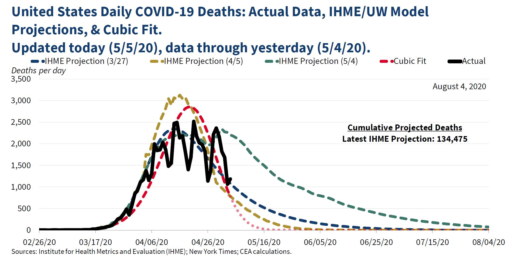

```{r setup, include=FALSE}

library(MASS)
library(ggplot2)
library(Sleuth3)
library(lubridate)
library(gam)
library(splines)

knitr::opts_knit$set(global.par = TRUE)
#options(digits = 4)
```

```{r,include=FALSE}
par(mar = c(4, 4, 0.5, 0.5)) # Set margins
``` 

## Philosophy

Data analysis and statistics are tools used in modeling.

* A **model** is a proposed distribution of a variable or variables
* Separate any model into two parts: the **signal** and the **noise**.
* This week we are focused on **signal**.

The most fundamental setting is a pair of variables, $x$ and $y$. We know something about $x$, and would like to leverage this to learn something about $y$, to the extent that this is possible. We call $x$ the **predictor** and $y$ the **response**. Write
$$
y=f(x)+\epsilon
$$
where the model function $f(x)$ is what we call the **signal** and $\epsilon$ is the **noise**.


"All models are wrong but some are useful" - George Box

The usefulness of a model comes when the signal is not drowned out by the noise. In other words the model is **statistically significant**.


## xkcd

{height=75%}

## Model misuse is not a joke

{height=75%}

## Reducible and irreducible error

If we had infinite knowledge, we could choose for our model function the expected value, or mean, of all $y$ such that $(x,y)$ is a possible data point. Write $\mu(x)$ for this expected value. 
$$
y=\mu(x)+\varepsilon
$$
We call $\varepsilon$ the **irreducible error** or **intrinsic variance**. It is the uncertainty that exists because of natural variation in the system described.

Any actual model function that we come up with will differ from this optimal function. Suppose we have a model function $f(x)$. We call the difference $f(x)-\mu(x)$ the **reducible error**. With a better $f$ we can reduce the reducible error.

## Bias and Variance

The reducible error can be broken down into two parts.

* The error due to **bias** is that part of the reducible error that comes from a model function's inability to change when it needs to.
* The error due to **variance** is that part of the reducible error that comes from a model function's excessive flexibility to match the particular data that are observed.

A model function with high bias error is said to **underfit** the data, and one with high variance error is an **overfit**. Whenever we are choosing a model, we must consider this **bias-variance tradeoff**.

## Parametric vs Non-parametric models

* A **parametric** model function is one defined in terms of arithmetic and analytic functions, such as logarithms, polynomials, or anything else you might have encountered in a math class like Calculus. The numbers such as coefficients and exponents defining the function are called the **parameters**.
* A **non-parametric** model function is defined in some other way. The first example we will encounter and use is *local regression* or *loess*. Trees and random forests are also non-parametric models.

## Linear function models

If $x$ and $y$ are both numeric variables, then the simplest possible relationship between them is a linear relationship. 
$$
y = \beta_0 + \beta_1 x +\epsilon
$$

* $\beta_0$ is the *intercept*, the value we predict for $y$ when $x$ is zero.
* $\beta_1$ is the *slope*, or predicted rate of change in $y$ with respect to $x$. Often written $\frac{\Delta y}{\Delta x}$ or $\frac{dy}{dx}$.

The tremendous advantage of the linear function model over all others is its simplicity. A disadvantage is a tendency towards high bias error.

Note: This model is linear in the variable $x$ **and** in the *parameters* $\beta_i$. The term "linear model" is frequently applied with both meanings, but the latter is more useful. The R command `lm` refers to linearity in the parameters.

## Linear models with multiple predictors

Extending to multiple predictor variables is straightforward.
$$
y=\beta_0 + \beta_1 x_1 +\beta_2 x_2 +\beta_3 x_3 + \epsilon
$$

* $\beta_i$ is the expected change in $y$ as $x_i$ changes and all else is constant.
* If the $x_i$ are correlated, these models can be unreliable.

## Linear models with categorical predictors

If a predictor variable is categorical, the linear model can still be used.

* One level is set as the **reference** level of the variable.
* For every other level of the variable, an **indicator variable** is defined, taking the value 1 when the variable has that level and 0 otherwise.
* The coefficient $\beta_i$ is the expected effect from observing level $i$ instead of the reference level. 

Examples:

* Control/ Treatment: Control is reference, $x_\text{treat}$ 
* Low/ Medium/ High: Low is reference, $x_\text{med}, x_\text{high}$

## Polynomial functions

Including powers of $x$ such as $x^2$ or $x^3$ can reduce bias. 

Example:
$$
y=\beta_0+\beta_1 x + \beta_2 x^2 +\epsilon
$$
This is still a linear model even though it includes the $x^2$ term.

\scriptsize
```{r, fig.width=8, fig.height=3.5}
ggplot(mtcars, aes(mpg, hp)) + geom_point(alpha=0.5) +
  geom_smooth(method = lm, formula = y~x, se=F) +
  geom_smooth(method = lm, formula = y~poly(x,2), se=F, color="red")
```


## Power functions

A power function model is of the form
$$
y=a x^k + \epsilon
$$
Note that $k$ can be any number, not just a positive integer. This is *not* a linear model because of the parameter $k$.

* Power models can have explanatory meaning if $x$ and $y$ have relevant dimensionality, like mass or area. 

Power function models can be fit using linear model techniques by taking logarithms. Ignoring the error term for a moment:
$$
\hat{y}=a x^k \qquad \iff \qquad \log(\hat{y})=\log(a)+k\log(x)
$$

## Back-transforms and error

Models fit on log-transformed variables can be exponentiated back to the original variables. How the error transforms can cause issues. 

* Exponentiating the predicted mean of a log-transformed variable does **not** predict the untransformed mean. 
    * When back-transforming, add half the variance in the residuals before exponentiating to recover the mean.
    * Diagnostics such as $R^2$ and p values apply to the transformed variables, not after back-transformation. 
* Linear regression assumes that the error is additive. Exponentiation changes this addition into multiplication. 

Suppose we fit a model:
$$
\log(y)\sim N\left(\hat\beta_0+\hat\beta_1\log(x), \sigma^2\right).
$$
Then the prediction for the mean of $y$ is
$$
e^{\hat\beta_0+\hat\beta_1\log(x)+\sigma^2/2}=e^{\hat\beta_0+\sigma^2/2}x^{\hat\beta_1}
$$
and the variance is dependent on $x$.

## [Kleiber's law](https://en.wikipedia.org/wiki/Kleiber%27s_law)

Mass and metabolic rate of mammals relate via a power law.
\scriptsize
```{r, fig.width=6, fig.height=2, message=FALSE}
ggplot(ex0826, aes(Mass, Metab)) + geom_point() + # data in Sleuth3
  scale_x_log10() + scale_y_log10() + geom_smooth(method = lm, se=F)
lm1 <- lm(log(Metab)~log(Mass), data = ex0826)
lm1$coefficients; var(lm1$residuals)
```
\normalsize
$$
\text{Metab}=e^{5.64+0.21/2}\times(\text{Mass})^{\only<2->{\alert}{0.74}} \times \epsilon
$$

## Rational models

The ratio of two polynomials is called a **rational function**. They can have asymptotes. Not generally linearizable.

Example: Michaelis-Menten/ Holling (@mcnickle)
$$
f(x)=\frac{ax}{b+x}
$$
\scriptsize
```{r, fig.width=8, fig.height=3}
curve(3*x/(5+x), from = 0, to = 50, ylim = c(0, 4), ylab = "y")
abline(h=3, lty = 4); abline(0, 3/5, lty = 2)
text(5, 0.3, "slope a/b at 0"); text(40, 3.3, "asymptote at y=a") 
```


## Exponential models

Exponential growth and decay are very common.

* $\frac{dy}{dx}$ means change in $y$ as $x$ changes. 
* $\frac{dy}{dx}=k \cdot y$ means $y$ changes by a fixed fraction ($k$) of itself.

The solution is
$$
y=a\,e^{kx}+\epsilon
$$

 Growth if $k>0$, decline if $k<0$.

* Exponential growth is usually bad for extrapolation. Something else tends to take over.
* With a little algebra, exponential decay can be used to model convergence to any asymptote.

These models are not linear, but taking logs make them so:
$$
\hat{y}=a\,e^{kx} \qquad \iff \qquad \log(\hat{y})=\log(a)+kx
$$

## Exponential decay example

```{r, include=FALSE}
set.seed(11)
expfun = function(x, a = 1, b = 1) {a * exp(-b * x)}
decay <- data.frame(age = sample(1:120, 100, replace = TRUE), species = sample(c("a","b","c"), 100, replace = TRUE))
decay$mass <- expfun(decay$age, a=10, b=0.01 + 0.002*(decay$species=="b")-0.005*(decay$species=="c"))+rnorm(100, 0, 0.5)
```

Exponential decay has long been used to model decomposition of biotic material. @olson

\scriptsize
```{r, fig.width=8, fig.height=3, message=FALSE}
# Simulated data, see RMarkdown for code.
ggplot(decay, aes(age, mass, color=species))+  
  expand_limits(y=0)+
  geom_point()+
  geom_smooth(method="glm", 
              method.args = list(family=gaussian(link="log")),
              se=FALSE)

```

## Decay model using log-transformed `mass`

In this model `speciesb` and `speciesc` are not significant at $\alpha=0.05$ but the interaction terms are, so their initial quantities do not appear to differ from species a, but their decay rates do.

\scriptsize
```{r}
lm2 <- lm(log(mass)~age*species, data=decay)
round(summary(lm2)$coefficients,4)
round(var(lm2$residuals),4)
```

\normalsize
The model for the mean is:
$$
\text{mass} = 10.242 \times e^{(-0.01-0.0023\chi_b+0.0046\chi_c)\text{age}}\times\epsilon
$$
$10.242 = e^{2.3225+0.008/2}$ and $\chi_b$ and $\chi_c$ are indicator functions. 

## Link functions

Most people who fit models to log transformed variables don't do the back-transformation. But this means that they aren't actually talking about the variables in the system they want to model.

**Generalized linear models** (GLMs) offer a solution: link functions. The mathematics of computing the parameters is more complicated, but they give a model that for untransformed variables.

A GLM with a log link for $y$ in terms of $x$ fits:
$$
\log(\mu_y)=\beta_0+\beta_1x
$$
or equivalently
$$
\mu_y=e^{\beta_0+\beta_1x}
$$
and the error is homoscedastic, as we like it.

Using GLMs and link functions means we can talk about our variables, not their transforms.


## Decay model using `glm` and log link

Specifying a link function for a GLM in R is done in the `family` argument, which is used to describe the shape of the error. For normally distributed error, use `family=gaussian`. 


\scriptsize
```{r}
lm2a <- glm(mass~age*species, family=gaussian(link=log), data=decay)
round(summary(lm2a)$coefficients, 4)
```

\normalsize
Note the increase in the p-value for the `age:speciesb` term. 

* It is possible that a difference between groups can appear significant for log transformed variables but not when we look at the variables directly.

## Logistic models

The logistic function makes a transition from $y=0$ to $y=1$.
$$
y=\frac{e^{a+bx}}{1+e^{a+bx}}
$$

\scriptsize
```{r, fig.width=8, fig.height=3}
curve(exp(-7+3*x)/(1+exp(-7+3*x)), from=0, to=4, ylim=c(0, 1), ylab="y")
```

\normalsize
* Mostly used for binary classification. (logistic regression)
* Also useful for populations with a carrying capacity.

Model with `link=logit` in `glm`. Default for `family=binomial`.

## Piecewise models

@bolker Figure 3.7. 

```{r, echo=FALSE}
library(plotrix)
par(mfrow=c(2,2),mar=c(0,0,0,0),lwd=2,cex=1.5)
eqcex=0.9
curve(ifelse(x<3,0,3),from=1,to=9,ylim=c(-1,5),
      xlim=c(0,11),axes=FALSE,ann=FALSE,type="s")
text(0,0,expression(a[1]))
text(10,3,expression(a[2]))
segments(3,-0.5,3,3.5,col="gray",lty=2)
text(3,-1,expression(s[1]))
#corner.label("threshold:",adj=0)
#corner.label(expression(paste(f(x)==a[1]," if ",x<s[1])),adj=0,yoff=0.13,cex=eqcex)
#corner.label(expression(paste(phantom(f(x))==a[2]," if ",x>s[1])),adj=0,yoff=0.21,cex=eqcex)
box(col="gray")
##
##curve(ifelse(x<3,1,1+0.75*(x-3)),from=0,to=10,ylim=c(0,8),axes=FALSE,ann=FALSE)
curve(ifelse(x<5,x,5),from=0,to=10,xlim=c(-1,12),ylim=c(0,8),axes=FALSE,ann=FALSE)
#corner.label("hockey stick:",adj=0)
#corner.label(expression(paste(f(x)==a*x," if ",x<s[1])),adj=0,yoff=0.13,cex=eqcex)
#corner.label(expression(paste(phantom(f(x))==a*s[1]," if ",x>s[1])),adj=0,yoff=0.21,cex=eqcex)
segments(5,0.5,5,5.5,col="gray",lty=2)
segments(c(1,2),c(1,1),c(2,2),c(1,2),col="gray")
text(2.5,1.5,"a")
text(5,0,expression(s[1]))
text(11,5,expression(a*s[1]))
box(col="gray")
##
a=2
s1=4
b=0.5
curve(ifelse(x<s1,a*x,(a*s1)-b*(x-s1)),from=0,to=20,
      ylim=c(0,12),axes=FALSE,ann=FALSE)
#curve(ifelse(x<6,0.5*x,3+1.5*(x-6)),add=TRUE,lty=2)
#corner.label("general piecewise linear:",adj=0)
#corner.label(expression(paste(f(x)==a*x," if ",x<s[1])),adj=0,yoff=0.13,cex=eqcex)
#corner.label(expression(paste(phantom(f(x))==a*s[1]-b*(x-s[1])," if ",x>s[1])),
             #adj=0,yoff=0.21,cex=eqcex)
segments(s1,0.5,s1,9,col="gray",lty=2)
segments(c(1,2),c(a,a),c(2,2),c(a,2*a),col="gray")
x1=10
x2=12
y1 = a*s1-b*(x1-s1)
y2 = a*s1-b*(x2-s1)
segments(c(x1,x1),c(y1,y2),
         c(x1,x2),c(y2,y2),col="gray")
text(x1-0.2,(y1+y2)/2,"-b",adj=1)
text(2.5,3,"a")
text(4,0,expression(s[1]))
box(col="gray")
##
## splines?
x1 <- 1:6
y1 <- c(0,2,4,1,2,3)
s1 <- splinefun(x1,y1)
curve(s1,axes=FALSE,ann=FALSE,from=0.5,to=6.5,ylim=c(0,5))
points(x1,y1,pch=16)
#y2 <- c(1,1.5,2,2.1,2.2,2.3)
#points(x1,y2,pch=1)
#s2 <- splinefun(x1,y2)
#curve(s2,add=TRUE,lty=2)
#corner.label("splines:",adj=0)
#corner.label("f(x) is complicated",adj=0,yoff=0.13,cex=eqcex)
box(col="gray")
```

## Splines

Weather drives the response. A spline can help account for this.

\scriptsize
```{r, fig.width=8, fig.height=4}
SoilMoist <- read.csv("data/SoilMoisture_ALL.csv") # Alexia Cooper's data
SoilMoist$TimeStamp <- mdy(SoilMoist$TimeStamp)
splinemod <- lm(Moisture~ns(TimeStamp,4), data=SoilMoist)
SoilMoist$pred <- predict(splinemod)
ggplot(SoilMoist, aes(TimeStamp,Moisture, color = Treat))+
  facet_wrap(~Site)+geom_point()+geom_line(aes(y=pred))
```


## Nearest neighbor averaging (knn)

* Assume the actual expected value function doesn't change too quickly: $\mu(x-h)\approx\mu(x)\approx\mu(x+h)$.

Choose a positive integer $k$ and define $f(x)$ as the average of $y_i$ for the points $(x_i,y_i)$ where $x-x_i$ is among the $k$ smallest.


Left: knn with $k=1$. Variance is high. Right: knn with $k=9$.

## Weighted averaging and local regression (loess)

Choose a distance and define $f(x)$ by linear regression using the data within that distance of $x$ or weighted based on that distance.


Simulated data. Blue curve is the true signal, orange is the weighted local regression.

## Loess in R

One way to do loess in R is to use `gam` and `lo`.

\scriptsize
```{r, fig.width=8, fig.height=3.5}
moistmod0 <- gam(Moisture~lo(TimeStamp), data=SoilMoist)
moistmod1 <- gam(Moisture~lo(TimeStamp)+Site, data=SoilMoist)
moistmod2 <- gam(Moisture~lo(TimeStamp)+Site+Treat, data=SoilMoist)
moistmod3 <- gam(Moisture~lo(TimeStamp)+Site*Treat, data=SoilMoist)
anova(moistmod0, moistmod1, moistmod2, moistmod3, test="F")
```

\normalsize
Using loess instead of a spline, we ask if `Site`, `Treat`, and their interaction are significant drivers of soil moisture after accounting for the common temporal variability. It appears that the answer is yes. 

## Acknowledgements

Some figures in this presentation are taken from "An Introduction to Statistical Learning, with applications in R"  [ Springer -@islr] with permission from the authors: G. James, D. Witten,  T. Hastie and R. Tibshirani 

Other figures are created using code provided by Ben Bolker related to his text "Ecological Models and Data in R" [Princeton -@bolker]

## References

