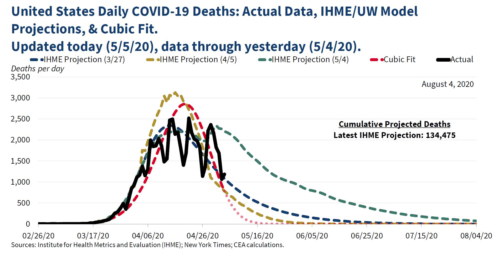
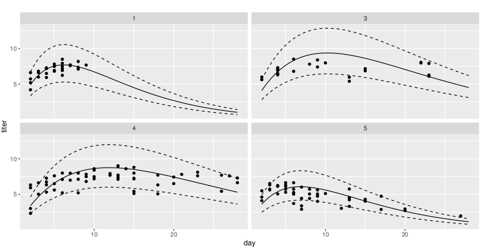

```{r setup, include=FALSE}

library(MASS)
library(ggplot2)
library(Sleuth3)
library(lubridate)
library(gam)
library(splines)
library(car)

knitr::opts_knit$set(global.par = TRUE)
#options(digits = 4)
```

```{r,include=FALSE}
par(mar = c(4, 4, 0.5, 0.5)) # Set margins
``` 

## Philosophy

Our basic scenario: $x$ is a **predictor** and $y$ the **response**. We want
$$
y=f(x)+\epsilon
$$
where the model function $f(x)$ is what we call the **signal** and $\epsilon$ is the **noise**.

* Making good models means choosing an appropriate $f(x)$ and an appropriate $\epsilon$.
* These choices are interdependent, but this week we'll focus more on signal than noise.

## xkcd

{height=75%}

## Model misuse is not a joke

{height=75%}

## Reducible and irreducible error

If we had infinite knowledge, we could choose for our model function the expected value, or mean, of all $y$ such that $(x,y)$ is a possible data point. Write $\mu(x)$ for this expected value. 
$$
y=\mu(x)+\varepsilon
$$
We call $\varepsilon$ the **irreducible error** or **intrinsic variance**. It is the uncertainty that exists because of natural variation in the system described.

Any actual model function that we come up with will differ from this optimal function. Suppose we have a model function $f(x)$. We call the difference $f(x)-\mu(x)$ the **reducible error**. With a better $f$ we can reduce the reducible error.

## Bias and Variance

The reducible error can be broken down into two parts.

* **Bias** is that part of the reducible error that comes from a model function's inability to change when it needs to.
* **Variance** is that part of the reducible error that comes from a model function's flexibility to match particular data.

A model function with **high bias error** is said to **underfit** the data, and one with **high variance error** is an **overfit**. Whenever we are choosing a model, we must consider this **bias-variance tradeoff**.

```{r, fig.width=8, fig.height=3, echo=FALSE, warning=FALSE}
ggplot(mtcars, aes(mpg, hp)) + geom_point(alpha=0.5) +
  geom_smooth(method = lm, formula = y~x, se=F, aes(color="degree 1, low variance, high bias")) +
  geom_smooth(method = lm, formula = y~poly(x,2), se=F, aes(color="degree 2"))+
  geom_smooth(method = lm, formula = y~poly(x,8), se=F, aes(color="degree 8, high variance, low bias"))+
  scale_colour_manual("Flexibility (polynomial degree)", values = c("darkolivegreen", "darkorange", "firebrick"))
```

## Parametric vs Non-parametric models

* A **parametric** model function is one defined in terms of arithmetic and analytic functions, such as logarithms, polynomials, or anything else you might have encountered in a math class like Calculus. The coefficients, exponents *et cetera* defining the function are called the **parameters**.
    
    * Parametric models can be more interpretable and meaningful, especially if there are some deterministic processes in play.
    * In principle, any function can be used, but a great deal of the work in statistics is done by linear functions and a few others.
    
* A **non-parametric** model function is defined in some other way. The first example we will encounter and use is *local regression* or *loess*. Trees, random forests, neural networks and most other are also non-parametric models.

   * Non-parametric models often have better predictive power and can fit data more effectively.
   

## Linear function models

If $x$ and $y$ are both numeric variables, then the simplest possible relationship between them is a linear relationship. 
$$
y = \beta_0 + \beta_1 x +\epsilon
$$

* $\beta_0$ is the *intercept*, the value we predict for $y$ when $x$ is zero.
* $\beta_1$ is the *slope*, or predicted rate of change in $y$ with respect to $x$. Often written $\frac{\Delta y}{\Delta x}$ or $\frac{dy}{dx}$.

The tremendous advantage of the linear function model over all others is its **simplicity**. A disadvantage is a tendency towards **high bias error**.

Note: This model is linear in the variable $x$ **and** in the *parameters* $\beta_i$. The term "linear model" is frequently applied with both meanings, but the latter is more useful. The R command `lm` refers to linearity in the parameters.

## Multiple predictors, categorical predictors

As we discussed last week, extending to multiple predictor variables or categorical predictors is relatively straightforward.
$$
y=\beta_0 + \beta_1 x_1 +\beta_2 x_2 +\beta_3 x_3 + \epsilon
$$

* $\beta_i$ is expected change in $y$ as $x_i$ changes and all else is fixed.
* If a predictor variable is categorical:

    * One level is set as the **reference** level of the variable.
    * For every other level of the variable, an **indicator variable** is defined, taking the value 1 when the variable has that level and 0 otherwise. My typical notation for an indicator variable is $\chi_i$.
    * The coefficient $\beta_i$ is the expected effect from observing level $i$ instead of the reference level. 
* If the $x_i$ are correlated, these models can be unreliable.

## Polynomial functions

Powers of $x$ such as $x^2$ or $x^3$ **reduce bias** but **increase variance**. 
$$
y=\beta_0+\beta_1 x + \beta_2 x^2 +\epsilon
$$
This is still a linear model even though it includes the $x^2$ term. The parameters $\beta_i$ appear linearly.

\scriptsize
```{r, fig.width=8, fig.height=3.5}
ggplot(mtcars, aes(mpg, hp)) + geom_point(alpha=0.5) +
  geom_smooth(method = lm, formula = y~x, se=F) +
  geom_smooth(method = lm, formula = y~poly(x,2), se=F, color="red")
```


## Power functions

A power function model looks like
$$
y=a x^k + \epsilon
$$

* $k$ can be any number, not just a positive integer. 
* This is **not a linear model** because of the parameter $k$.
* Power models can have explanatory meaning, for example if $x$ and $y$ have relevant dimensionality, like mass or area. 

Power function models can be fit using linear model techniques by taking logarithms. Ignoring the error term for a moment:
$$
\hat{y}=a x^k \qquad \iff \qquad \log(\hat{y})=\log(a)+k\log(x)
$$

## Back-transforms and error

Models fit on log-transformed variables can be exponentiated back to the original variables. How the error transforms can cause issues. 

* Exponentiating the predicted mean of a log-transformed variable does **not** predict the untransformed mean. 
    * When back-transforming, add half the variance in the residuals before exponentiating to recover the mean.
    * Diagnostics such as $R^2$ and p values apply to the transformed variables, not after back-transformation. 
* Linear regression assumes that the error is additive. Exponentiation changes this addition into multiplication. 

Suppose we fit a model:
$$
\log(y)\sim N\left(\hat\beta_0+\hat\beta_1\log(x), \sigma\right).
$$
Then the prediction for the mean of $y$ is
$$
e^{\hat\beta_0+\hat\beta_1\log(x)+\sigma^2/2}=e^{\hat\beta_0+\sigma^2/2}x^{\hat\beta_1}
$$
and the variance is dependent on $x$.

## [Kleiber's law](https://en.wikipedia.org/wiki/Kleiber%27s_law)

Mass and metabolic rate of mammals relate via a power law.
\scriptsize
```{r, fig.width=6, fig.height=2, message=FALSE}
ggplot(ex0826, aes(Mass, Metab)) + geom_point() + # data in Sleuth3
  scale_x_log10() + scale_y_log10() + geom_smooth(method = lm, se=F)
lm1 <- lm(log(Metab)~log(Mass), data = ex0826)
lm1$coefficients; var(lm1$residuals)
```
\normalsize
$$
\text{Metab}=e^{5.64+0.21/2}\times(\text{Mass})^{\only<2->{\alert}{0.74}} \times \epsilon
$$


## Exponential models

Exponential growth and decay are very common.

* $\frac{dy}{dx}=k \cdot y$ 
* Change in $y$ is proportional (with coefficient $k$) to $y$ itself.

The solution is
$$
y=a\,e^{kx}+\epsilon, , \quad a=\text{initial value}, \quad k=\text{growth or decay rate}
$$

 Growth if $k>0$, decline if $k<0$.

* Exponential growth is usually bad for extrapolation. Something else tends to take over.
* With a little algebra, exponential decay can be used to model convergence to any asymptote.

These models are not linear, but taking logs make them so:
$$
\hat{y}=a\,e^{kx} \qquad \iff \qquad \log(\hat{y})=\log(a)+kx
$$

## Exponential decay example

```{r, include=FALSE}
set.seed(11)
expfun = function(x, a = 1, b = 1) {a * exp(-b * x)}
decay <- data.frame(age = sample(1:120, 100, replace = TRUE), k = sample(c("0.01","0.012","0.005"), 100, replace = TRUE))
decay$mass <- expfun(decay$age, a=10, b=0.01 + 0.002*(decay$k=="0.012")-0.005*(decay$k=="0.005"))+rnorm(100, 0, 0.5)
```

Exponential decay can model decomposition, radioactive decay, temperature changes, and many other scenarios.

Simulate: $a=10, k=0.005+0.005\chi_{green}+0.007\chi_{blue}, \sigma=0.5$
\begin{align*}
\hat{\texttt{mass}}&=10 \, e^{(0.005+0.005\chi_{green}+0.007\chi_{blue})\texttt{age}}, \quad \text{or} \\ \log(\hat{\texttt{mass}})&=\log10 + (0.005+0.005\chi_{green}+0.007\chi_{blue})\texttt{age}
\end{align*}

\scriptsize
```{r, fig.width=8, fig.height=3, message=FALSE}
# Simulated data, see RMarkdown for code.
ggplot(decay, aes(age, mass, color=k))+geom_point()
```

## Option 1: model using log-transformed `mass`

Take logs of all the `mass` values and then make a linear model.

\scriptsize
```{r}
lm2 <- lm(log(mass)~age*k, data=decay)
```
```{r, echo=FALSE}
round(summary(lm2)$coefficients,4)
```
\normalsize
Residual variance is `r round(var(lm2$residuals),4)`. At $\alpha=0.05$ this model says \ldots

* Significant intercept: the initial value for the `mass` for red points is not 1. (Its log is not 0.)
* Significant coefficient on `age`: $k\neq0$ for the red points.
* No significant coefficients on indicator variables: initial `mass` does not appear to depend on color.
* Significant coefficients of the interaction terms for `age` and the indicator variables: decay rates differ by color.

## Option 1 (continued)
\scriptsize
```{r, echo=FALSE}
round(summary(lm2)$coefficients,4)
```
\normalsize
Plugging the significant coefficients in and simplifying, the model is:
\scriptsize
$$
\log(\texttt{mass}) = 2.3243+(-0.0054-0.0046\chi_{green}-0.0069\chi_{blue})\texttt{age} + \epsilon
$$
\normalsize
Where  $\epsilon\sim N(0,\sqrt{0.008})$. Transforming back to the original scale\footnote{using $10.26048=e^{2.3243+0.008/2}$}:
$$
\texttt{mass} = 10.26048 \times e^{(-0.0054-0.0046\chi_{green}-0.0069\chi_{blue})\texttt{age}}\times e^\epsilon
$$


This is pretty close to the actual model, but there is a potential issue. The error has become multiplicative instead of additive, and it follows this "exponential normal" distribution.

## Link functions

Many people who fit models to log transformed variables don't do the back-transformation. But this means that they aren't actually talking about the variables in the system they want to model.

**Generalized linear models** (GLMs) offer a solution: 

Assume there is an invertible function $g(x)$ and define a model 
$$
y=g(\beta_0+\beta_1x)+\epsilon.
$$

The function $g^{-1}$ is called the **link**. For example, a GLM with a log link finds:
$$
\log(\hat y)=\hat\beta_0+\hat\beta_1x
$$
or equivalently
$$
\hat y=e^{\hat\beta_0+\hat\beta_1x}.
$$

Using GLMs and link functions means we can talk about our variables, not their transforms, and errors are homoscedastic.


## Option 2: model using `glm` and log link

Specifying a link function for a GLM in R is done in the `family` argument (which is also used to describe the shape of the error). For normally distributed error, use `family=gaussian`. 

\scriptsize
```{r}
lm2a <- glm(mass~age*k, family=gaussian(link=log), data=decay)
```
```{r echo=FALSE}
round(summary(lm2a)$coefficients, 4)
```
\normalsize

The resulting model is
$$
\texttt{mass} = 10.20829 \times e^{(-0.0054-0.0045\chi_{green}-0.0062\chi_{blue})\texttt{age}} + \epsilon
$$
where $\epsilon$ is normally distributed with standard deviation `r round(sd(resid(lm2a)),4)`.


## Logistic models

The logistic function makes a transition from $y=0$ to $y=1$.
$$
y=\frac{e^{a+bx}}{1+e^{a+bx}}
$$

\scriptsize
```{r, fig.width=8, fig.height=3}
curve(exp(-7+3*x)/(1+exp(-7+3*x)), from=0, to=4, ylim=c(0, 1), ylab="y")
```

\normalsize
* Mostly used for binary classification. (logistic regression)
* Also useful for populations with a carrying capacity.

Model with `link=logit` in `glm`. Default for `family=binomial`.


## Other function models

Any function can potentially be used as a model function. 

* Several pre-packaged link functions are available and work well with particular choices of error distribution.
* More complicated functions require more complicated code.
$$
\mu_{titer}=a_{g}te^{-b_{g}t}
$$




## Splines

Weather drives the response. A spline can help account for this.

\scriptsize
```{r, fig.width=8, fig.height=4}
SoilMoist <- read.csv("data/SoilMoisture_ALL.csv") # A. Cooper's data
SoilMoist$TimeStamp <- mdy(SoilMoist$TimeStamp) # from lubridate package
splinemod <- lm(Moisture~ns(TimeStamp,4), data=SoilMoist)
SoilMoist$pred <- predict(splinemod)
ggplot(SoilMoist, aes(TimeStamp,Moisture, color = Treat))+
  facet_wrap(~Site)+geom_point()+geom_line(aes(y=pred))
```


## Nearest neighbor averaging (knn)

* Assume the actual expected value function doesn't change too quickly: $\mu(x-h)\approx\mu(x)\approx\mu(x+h)$.

Choose a positive integer $k$ and define $f(x)$ as the average of $y_i$ for the points $(x_i,y_i)$ where $x-x_i$ is among the $k$ smallest.


Left: knn with $k=1$. Variance is high. Right: knn with $k=9$.

## Weighted averaging and local regression (loess)

Choose a distance and define $f(x)$ by linear regression using the data within that distance of $x$ or weighted based on that distance.


Simulated data. Blue curve is the true signal, orange is the weighted local regression.

## Loess in R

One way to do loess in R is to use `gam` and `lo`.

\scriptsize
```{r, fig.width=8, fig.height=3.5}
moistmod0 <- gam(Moisture~lo(TimeStamp), data=SoilMoist)
moistmod1 <- gam(Moisture~lo(TimeStamp)+Site, data=SoilMoist)
moistmod2 <- gam(Moisture~lo(TimeStamp)+Site+Treat, data=SoilMoist)
moistmod3 <- gam(Moisture~lo(TimeStamp)+Site*Treat, data=SoilMoist)
anova(moistmod0, moistmod1, moistmod2, moistmod3, test="F")
```

\normalsize
Using loess instead of a spline, we ask if `Site`, `Treat`, and their interaction are significant drivers of soil moisture after accounting for the common temporal variability. It appears that the answer is yes. 

## Acknowledgements

Some figures in this presentation are taken from "An Introduction to Statistical Learning, with applications in R"  [ Springer -@islr] with permission from the authors: G. James, D. Witten,  T. Hastie and R. Tibshirani 

Other figures are created using code provided by Ben Bolker related to his text "Ecological Models and Data in R" [Princeton -@bolker]

## References

