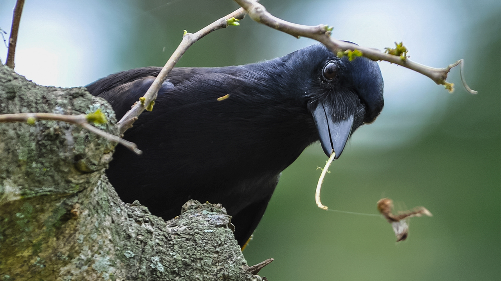

```{r setup, include=FALSE}
knitr::opts_knit$set(global.par = TRUE)
library(ggplot2)
library(emdbook)
library(MASS)
```

```{r,include=FALSE}
par(mar = c(4, 4, 0.5, 0.5)) # Set margins
``` 

## Philosophy

Now that we have the components for building models, we need to study how to evaluate and use our models. 

One of the things that having a model (and a computer) allows us to do is generate simulated data. With simulated data we can:

* Compare models to data (hypothesis testing)
* Make predictions (confidence intervals)
* Plan data collection (power analysis)

Since we'll be generating random numbers in these slides, I'll set a seed now to initialize the process.
```{r}
set.seed(222)
```
## A one variable example

```{r echo=FALSE}
crows <- read.csv("data/crows.csv")
```

A study in @krwck examined sexual dimorphism in New Caledonian crows. Sex and weight for 18 birds were recorded.

\scriptsize
```{r, echo=F, fig.width=4, fig.height=1}
ggplot(crows, aes(weight, sex))+geom_point()
```
\normalsize



## Crow example (cont.)

This is a classic scenario that calls for a $t$-test.

```{r}
t.test(weight~sex, data = crows)
```

## Crow example (cont. 2)

Alternatively, we could model the null hypothesis of no difference by **randomizing** the data. What would these data look like if we had the same eighteen weights but randomly reassigned to the birds? 

\scriptsize
```{r fig.width=4, fig.height=2}
crows$shuffled_weight <- sample(crows$weight, length(crows$weight))
ggplot(crows, aes(shuffled_weight, sex))+geom_point()
```

## Crow example (cont 3.)

Repeat the shuffle many times, and see how our data compare. We'll use the same statistic that the $t$-test used: difference in means between groups.

\scriptsize
```{r}
obs <- mean(crows$weight[crows$sex=="f"])-
       mean(crows$weight[crows$sex=="m"])
num_sim <- 10000
diffs <- numeric(num_sim)
for(i in 1:num_sim){
  sim_weight <- sample(crows$weight, length(crows$weight))
  diffs[i] <- mean(sim_weight[crows$sex=="f"])-
              mean(sim_weight[crows$sex=="m"])
}
mean(abs(obs)<=abs(diffs)) 
```
\normalsize
We see three examples in 10,000 runs where the observed difference in means is at least as large as the observed difference in absolute value. Note that this matches very closely to the p value of 0.000384 from the $t$-test.

## An existing model for crow weights

Randomization allowed us to test our data against the null theory of complete independence of the sex and weight variables.

Suppose instead that previous observations lead us to predict that New Caledonian crows will exhibit sexual dimorphism for weight, with female weights distributed as $N(250,20^2)$ and male weights distributed as $N(320, 35^2)$. 

```{r echo=F, fig.height=3}
ggplot(data.frame(weight=175:425), aes(weight))+
  geom_function(fun=dnorm, args=list(mean=250, sd=20), color="red")+
  geom_function(fun=dnorm, args=list(mean=320, sd=35), color="blue")+
  labs(y="")
```


## Simulation based on the model

We will **simulate** data based on this model. 

\scriptsize
```{r, fig.height=3, warning=FALSE, message=FALSE}
diffs <- numeric(num_sim)
for(i in 1:num_sim){
  sim <- data.frame(sex = c(rep("f", 6), rep("m", 12)),
                    weight = c(rnorm(6,250,20), rnorm(12, 320,35)))
  diffs[i] <- mean(sim[sim$sex=="f",]$weight)-
              mean(sim[sim$sex=="m",]$weight)
}
ggplot(data.frame(diffs), aes(diffs))+
  geom_freqpoly()+geom_vline(xintercept = obs)
```
\normalsize
The observed differences in mean weights is not inconsistent with the model.


## A simple two variable example

Simulation can be used to create data based on arbitrarily complicated models.

A linear function model with normal errors:

\scriptsize
```{r fig.height = 3, fig.width = 7}
x <- 1:20 # Define inputs
a <- 2; b <- 1 # Set parameters
y_det <- a + b*x # Compute signal part of output
y <- rnorm(20, mean = y_det, sd = 2) # Create noise around the signal
ggplot(data.frame(x=x, y=y), aes(x,y))+
  geom_point() + geom_abline(intercept = a, slope = b) 
```


## Another example

A hyperbolic function model with negative binomial errors:

\scriptsize
```{r fig.height = 3, fig.width = 7}
x <- runif(50, min = 0, max = 5) # Define inputs
a <- 20; b <- 1; k <- 5 # Set parameters
y_det <- a*b/(b+x) # Compute signal part of output
y <- rnbinom(50, mu = y_det, size = k) # Create noise
ggplot(data.frame(x=x, y=y), aes(x,y))+ 
  geom_point() + geom_function(fun = function(x) a*b/(b+x) )
```


## Adding a categorical predictor

To the previous example, add a grouping factor:

\scriptsize
```{r fig.height = 3, fig.width = 7}
g <- sample(c(0,1), 50, replace = TRUE) # Define new inputs
a <- 20-10*g; b <- 1+g # Redefine parameters to include new input
y_det <- a*b/(b+x) # Compute signal part of output
y <- rnbinom(50, mu = y_det, size = k) # Create noise
ggplot(data.frame(x=x,y=y,g=factor(g)), aes(x,y, color=g))+
  geom_point() + 
  geom_function(fun = function(x) (20)/(1+x), aes(color="0")) +
  geom_function(fun = function(x) (10)/(2+x), aes(color="1"))
```

## A complicated spatial model

A study of annual weeds in @pacsil, described in Section 5.2.2.2 of @bolker gives an opportunity to see how complicated models might be built up from simpler components.

The model includes:

* A spatial arrangement of pigweed plants,
* an index of crowding computed from the arrangement,
* an estimate of biomass based on the crowding index, and
* an estimate of seed production based on biomass.

We can model each step of this process and chain them together for the final model.

## The spatial arrangement

The spatial arrangement comes from randomly placing parent plants in a rectangular plot, and then generating offspring plants randomly dispersed from the parent plants. 

First we set parameters for this process:
\scriptsize
```{r}
L = 30 # consider a 30 by 30 plot 
nparents = 50 # and 50 parent plants
offspr_per_parent = 10 
noffspr = nparents*offspr_per_parent
dispdist = 2 # mean distance from parent to offspring 
```
\normalsize

Then we place the parent plants:
\scriptsize
```{r}
parent_x = runif(nparents,min=0,max=L)
parent_y = runif(nparents,min=0,max=L)
parent_pos <- cbind(parent_x,parent_y)
```
\normalsize

Then the offspring:
\scriptsize
```{r}
angle = runif(noffspr,min=0,max=2*pi) 
dist = rexp(noffspr,1/dispdist)
offspr_x = rep(parent_x,each=offspr_per_parent)+cos(angle)*dist
offspr_y = rep(parent_y,each=offspr_per_parent)+sin(angle)*dist
pos <- cbind(offspr_x,offspr_y)
```

## The spatial arrangement (cont.)

Here is a view of the resulting arrangement.

\scriptsize
```{r  fig.height = 3, fig.width = 7}
ggplot()+
  geom_point(data=as.data.frame(pos), 
             aes(offspr_x, offspr_y, color="child"))+
  geom_point(data=as.data.frame(parent_pos), 
             aes(parent_x, parent_y, color="parent"))+
  labs(x="", y="", color="")
```

## Computing an index of crowding

For the crowding index, first compute distances between plants.
\scriptsize
```{r  fig.height = 2, fig.width = 2}
ndist <- as.matrix(dist(pos))
heatmap(ndist, Rowv = NA, Colv=NA)
```
\normalsize

Count the number of plants other the plant being considered within a distance of 2. Multiply the result by 3 and add 1.

\scriptsize
```{r}
nbrcrowd = rowSums(ndist<2)-1
ci = nbrcrowd*3
```

## Estimating total biomass

The authors of the study determine a model for total biomass. Their estimate is based on the competition index and stochastic noise from a Gamma distribution.
\scriptsize
```{r fig.height = 3, fig.width = 7}
M=2.3; alpha=0.49 # parameters from Pacala and Silander
mass_det=M/(1+ci) # deterministic part of the model
mass = rgamma(length(mass_det),scale=mass_det,shape=alpha)
weeds <- data.frame(ci=ci, mass=mass, mass_det=mass_det, 
                    x=offspr_x, y=offspr_y)
ggplot(weeds, aes(ci, mass))+geom_point()+geom_line(aes(y=mass_det))+
  scale_y_log10()+labs(x="Competition index", y="Biomass")
```

## Estimating seed production

Mean seed production is estimated to be proportional to biomass, with negative binomial noise.

\scriptsize
```{r fig.height = 3, fig.width = 7, message=FALSE}
b = 271.6; k = 0.569 # parameters from Pacala and Silander
weeds$seed_det <- b*mass # the deterministic part of the model
weeds$seed <- rnbinom(length(weeds$seed_det),mu=weeds$seed_det,size=k)
ggplot(weeds,aes(mass,seed+1))+geom_point()+geom_line(aes(y=seed_det+1))+
  geom_line(aes(y=qnbinom(0.025,mu=seed_det,size=k)+1), linetype=2)+
  geom_line(aes(y=qnbinom(0.975,mu=seed_det,size=k)+1), linetype=2)+
  scale_y_log10()+scale_x_log10()+
  labs(x="Biomass",y="Seed Production + 1")
```


## Simulated distribution of total seed production

\tiny
```{r fig.height = 3, fig.width = 7}
num_sim <- 1000; total_seeds <- numeric(num_sim)
for(i in 1:num_sim){
parent_x = runif(nparents,min=0,max=L); parent_y = runif(nparents,min=0,max=L)
angle = runif(noffspr,min=0,max=2*pi); dist = rexp(noffspr,1/dispdist)
offspr_x = rep(parent_x,each=offspr_per_parent)+cos(angle)*dist
offspr_y = rep(parent_y,each=offspr_per_parent)+sin(angle)*dist
pos <- cbind(offspr_x,offspr_y); ndist <- as.matrix(dist(pos))
nbrcrowd = rowSums(ndist<2)-1; ci = nbrcrowd*3; mass_det=M/(1+ci)
mass = rgamma(length(mass_det),scale=mass_det,shape=alpha)
seed_det <- b*mass ; seed <- rnbinom(length(seed_det),mu=seed_det,size=k)
total_seeds[i] <- sum(seed)
}
hist(total_seeds)
```

## Hypothesis testing with a simulated distribution

We saw in the crow example how to do hypothesis testing with a simulated distribution: 

* Given an observed value of a statistic, calculate the fraction of the simulated values that are at least as extreme as the observed value. This is the p value.

Suppose that in a $30\times30$ plot with 50 parent plants, each having 10 offspring, you determine that there is a seed set of 23000 seeds. Test the hypothesis that this seed set is consistent with the model.

```{r}
mean(total_seeds>=23000)
```

At the $\alpha=0.05$ threshold, this does register as significantly more seeds than expected. Note this is a one-sided test. In some cases (crows for example) we can explicitly check a two-sided condition. Otherwise, doubling p values is a common adjustment to make a one-sided p value comparable with two-sided ones.

## Confidence intervals from a simulated distribution

Computing confidence intervals from a simulated distribution is straightforward and can be done using the `quantile` function.

```{r}
quantile(total_seeds, c(0.025, 0.975))
```

## Statistical power

In a hypothesis test based on an assumed distribution of a statistic, there are four important quantities, and and three of them determine the fourth:

* Sample size ($n$) or other model/ experimental parameters
* Effect size ($\Delta=\mu_a-\mu_0$)
* Significance level ($\alpha$)
* Power (1-$\beta$)

```{r echo=FALSE, warning=FALSE, fig.height=6, fig.width=14}
# copied from https://rpsychologist.com/creating-a-typical-textbook-illustration-of-statistical-power-using-either-ggplot-or-base-graphics
library(grid) # need for arrow()
m1 <- 0  # mu H0
sd1 <- 1.5 # sigma H0
m2 <- 3.5 # mu HA
sd2 <- 1.5 # sigma HA
 
z_crit <- qnorm(1-(0.05/2), m1, sd1)
 
# set length of tails
min1 <- m1-sd1*4
max1 <- m1+sd1*4
min2 <- m2-sd2*4
max2 <- m2+sd2*4          
# create x sequence
x <- seq(min(min1,min2), max(max1, max2), .01)
# generate normal dist #1
y1 <- dnorm(x, m1, sd1)
# put in data frame
df1 <- data.frame("x" = x, "y" = y1)
# generate normal dist #2
y2 <- dnorm(x, m2, sd2)
# put in data frame
df2 <- data.frame("x" = x, "y" = y2)
 
# Alpha polygon
y.poly <- pmin(y1,y2)
poly1 <- data.frame(x=x, y=y.poly)
poly1 <- poly1[poly1$x >= z_crit, ] 
poly1<-rbind(poly1, c(z_crit, 0))  # add lower-left corner
 
# Beta polygon
poly2 <- df2
poly2 <- poly2[poly2$x <= z_crit,] 
poly2<-rbind(poly2, c(z_crit, 0))  # add lower-left corner
 
# power polygon; 1-beta
poly3 <- df2
poly3 <- poly3[poly3$x >= z_crit,] 
poly3 <-rbind(poly3, c(z_crit, 0))  # add lower-left corner
 
# combine polygons. 
poly1$id <- 3 # alpha, give it the highest number to make it the top layer
poly2$id <- 2 # beta
poly3$id <- 1 # power; 1 - beta
poly <- rbind(poly1, poly2, poly3)
poly$id <- factor(poly$id,  labels=c("power","beta","alpha"))

# plot with ggplot2
ggplot(poly, aes(x,y, fill=id, group=id)) +
  geom_polygon(show_guide=F, alpha=I(8/10)) +
  # add line for treatment group
  geom_line(data=df1, aes(x,y, color="H0", group=NULL, fill=NULL), size=1.5, show_guide=F) + 
  # add line for treatment group. These lines could be combined into one dataframe.
  geom_line(data=df2, aes(color="HA", group=NULL, fill=NULL),size=1.5, show_guide=F) +
  # add vlines for z_crit
  geom_vline(xintercept = z_crit, size=1, linetype="dashed") +
  # change colors 
  scale_color_manual("Group", 
                     values= c("HA" = "#981e0b","H0" = "black")) +
  scale_fill_manual("test", values= c("alpha" = "#0d6374","beta" = "#be805e","power"="#7cecee")) +
  # beta arrow
  annotate("segment", x=0.1, y=0.045, xend=1.3, yend=0.01, arrow = arrow(length = unit(0.3, "cm")), size=1) +
  annotate("text", label="beta", x=0, y=0.05, parse=T, size=8) +
  # alpha arrow
  annotate("segment", x=4, y=0.043, xend=3.4, yend=0.01, arrow = arrow(length = unit(0.3, "cm")), size=1) +
  annotate("text", label="frac(alpha,2)", x=4.2, y=0.05, parse=T, size=8) +
  # power arrow
  annotate("segment", x=6, y=0.2, xend=4.5, yend=0.15, arrow = arrow(length = unit(0.3, "cm")), size=1) +
  annotate("text", label="1-beta", x=6.1, y=0.21, parse=T, size=8) +
  # H_0 title
  annotate("text", label="H[0]", x=m1, y=0.28, parse=T, size=8) +
  # H_a title
  annotate("text", label="H[a]", x=m2, y=0.28, parse=T, size=8) +
  ggtitle("Adapted from http://rpsychologist.com (CCA 4.0)") +
  # remove some elements
  theme(panel.grid.minor = element_blank(),
             panel.grid.major = element_blank(),
             panel.background = element_blank(),
             plot.background = element_rect(fill="#f9f0ea"),
             panel.border = element_blank(),
             axis.line = element_blank(),
             axis.text.x = element_blank(),
             axis.text.y = element_blank(),
             axis.ticks = element_blank(),
             axis.title.x = element_blank(),
             axis.title.y = element_blank(),
             plot.title = element_text(size=22))
```
 

 
## Power for traditional tests
 
Power computers for many standard tests are available in R.

* Suppose male and female crow weights are both approximately normally distributed with a pooled standard deviation of 27. How many crows of each sex would we need to weigh if we wanted to have a 90% probability of correctly noting a difference in mean weights of 70?

\scriptsize
```{r}
power.t.test(delta=70, sd=27, power=0.9)
```
\normalsize
Also see the `pwr` package.

## Power computations using simulation

In a situation where you aren't using a standard statistical test, for example if you model your data with `glm` instead of `lm`, you can use simulation to compute power.

This is what we'll do in the lab.

## References