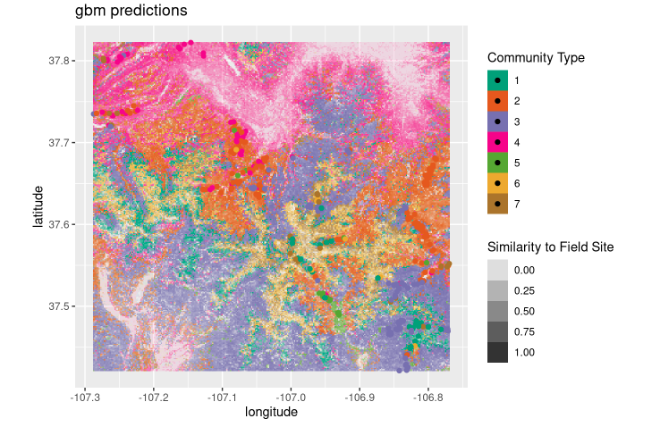

```{r setup, include=FALSE}

library(MASS)
library(openintro)

library(tidyverse)
library(lubridate)
library(MASS)

by_zone <- read.csv("data/by_zone.csv")
by_zone$rating_below <- factor(by_zone$rating_below)
by_zone$rating_near <- factor(by_zone$rating_near)
by_zone$rating_above <- factor(by_zone$rating_above)
by_zone$modality <- factor(by_zone$modality, levels = c("Non.motorized", "Mechanized", "Hybrid", "Motorized"))
by_zone$Zone <- factor(by_zone$Zone, levels = c("Kebler", "Slate River Rd", "Washington Gulch", "East River", "Brush/Cement"))

```

## Philosophy

<!-- This class builds on the knowledge and skills you acquired in your previous study of statistics. We are going to use mathematical language to develop a framework for bringing what may have seemed like a disparate collection of topics and tools into a unified way of thinking. With that framework in place we'll see what we can say about some of the problems that were too difficult for Introductory Statistics. 

For example, after this class you will be able to tackle -->

* multiple variables and high dimensional data,
* situations where assuming normality is a bad idea,
* classification problems,
* and more.

##  Winter Recreation: Modeling Multiple Variables

Visitation rates as a function of 
\begin{itemize}
\item new snow in the previous three days, 
\item modality,
\item trailhead location,
\item year. 
\end{itemize}
Motorized users head to Kebler, non-motorized users to Snodgrass. Some shift in these patterns year to year is visible.

```{r,echo=F, warning = F, fig.height=5}
ggplot(by_zone, aes(past3snow, user.count, color = Zone))+
  geom_jitter(height = 0, width = 0.2, alpha = 0.5)+
  facet_grid(modality~year)+
  scale_y_log10()+
  labs(x="Past 3 Days Snow (in)", y="# Users")
```

## SRA: Simulation and Nonparametric Models

Western's Strategic Resource Allocation process needed to avoid assuming normal distributions. Instead, randomization determined how a program's rankings compared with the rest of campus.


## Forest Fire Recovery: Plant Community Classifications

Unsupervised learning discovered plant communities from transect data. Gradient boosted regression trees detect these communities in satellite data. 



## Data frame $\to$ Statistical analysis $\to$ Model

Data frames are arrangements of **observations** of **variables**. An **observation** is a single unit.  A **variable** is a measurement made on that unit 

* Record observations as **rows** and variables in **columns**.    
* Variables can be **categorical** or **numerical**.
    * Categorical variables can be **binary** or not, **ordered** or not.
    * Numerical variables can be **discrete** or **continuous**.
* Dates, times and locations merit special consideration.
* Vocabulary is not universal: Factor, case, treatment \ldots

\footnotesize
```{r}
head(Sitka) # from package MASS
```
\normalsize

## Distributions

The **distribution** of a variable is a description of how often it takes each possible value.

* An **observed distribution** is what we actually see.
    * "the sample"
    * column of a data frame
    * summarized by computing means, standard deviations, medians, sample proportions, et cetera.
    
* A **theoretical distribution** is a mathematical guess.
    * "assume $X$ is normally distributed"
    * "assume the probability of success is 50%"
    * might come from a formula
    * might come from randomization/ simulation
    
Much of statistics is concerned with comparing observed distributions to theoretical distributions.

We often discuss distributions of variables other than those explicitly in our data, such as the mean of a variable in our data, a test statistic like $\chi^2$, or the residuals of a linear model.

## Distributions of Categorical Variables

* The distribution of a categorical variable is a list of the percentage of observations in each category.
```{r echo=TRUE, fig.height=4}
table(Sitka$treat)/length(Sitka$treat)
barplot(table(Sitka$treat))
```


## Distributions of Numeric Variables

* Picture the distribution of a numeric variable with a histogram, boxplot or density estimate.
```{r out.height="0.5\\textheight" }
hist(Sitka$size)
```

* Shape: center, spread, skew, kurtosis

## Summaries of Numeric Variables

```{r echo=TRUE}
summary(Sitka$size)
```

```{r}
quantile(Sitka$size, c(0.025,0.975))
```

```{r}
sd(Sitka$size)
```

```{r}
var(Sitka$size)
```

```{r}
IQR(Sitka$size)
```

## A familiar theoretical distribution: the Normal distribution

* Sums of many independent effects are normally distributed.
* Means are normally distributed.
* Proportions of successes are eventually normally distributed.
* Formula that you never use: $\displaystyle N(\mu,\sigma^2)(x)=\frac{1}{\sigma\sqrt{2 \pi}}e^{-\frac{1}{2}\left(\frac{x-\mu}{\sigma}\right)^2}$
* The **standard normal distribution** has $\mu=0$, $\sigma=1$.
* Observations on disparate scales can be standardized with z scores: $\displaystyle z=\frac{x-\mu}{\sigma}$
    
{height=35%}
    
## Randomization for a Theoretical Distribution

\scriptsize
```{r, fig.height=4}
n <- nrow(Sitka); num_ozone <- sum(Sitka$treat=="ozone"); num_sim <- 1000
set.seed(17)                # initialize the random number generator
diffs <- numeric(num_sim)   # initialize a vector to hold the differences
for(i in 1:num_sim){          # loop: repeat the following num_sim times
  ozone <- sample(1:n,num_ozone)       # 1. randomly select observations
  ozone_mean <- mean(Sitka$size[ozone])# 2. average selected observations
  control_mean <- mean(Sitka$size[-ozone])# 3. average the others
  diffs[i] <- ozone_mean - control_mean}  # 4. store difference in means
hist(diffs)     # plot the resulting distribution
```
\normalsize    
    
## Other Theoretical Distributions from Intro Stats
  
Your first statistics class introduced you to several useful distributions: 
    
* t - Like the normal distribution, but adjusted for describing means of small samples.
* $\chi^2$ - Sum of several squared standard normal distributions. Useful when discussing several proportions at once, such as when considering categorical variables with more than two possible values.
* F - Similar to $\chi^2$, used in ANOVA.

And maybe\ldots

* Binomial - How many successes in $n$ trials?
* Poisson - Count of discrete events in fixed time or space.
* Perhaps others? We'll see lots more\ldots

## Sampling Distributions

Given a data set (the sample) and a quantity that we can calculate from the data (a sample or test statistic) we propose an expected distribution for that calculated quantity (the sampling distribution).

* Sampling distributions are never observed, always theoretical.

Having a sampling distribution allows us to do inference.

```{r, echo=F, fig.height=5}
normTail(M = c(-1.96,1.96), col = COL[6,4], cex.axis = 1.25, xLab = "symbol")
text(x = 0, y = 0.25, "0.95", col = COL[4], cex = 1.5)
lines(x = c(-1.96,-1.96), y = c(0, 0.15), lty = 2)
lines(x = c(1.96,1.96), y = c(0, 0.15), lty = 2)
text(x = -1.96, y = 0.20, "z = -1.96", col = COL[1], cex = 1.5)
text(x = 1.96, y = 0.20, "z = 1.96", col = COL[1], cex = 1.5)
text(x = -2.7, y = 0.07, "0.025", col = COL[4], cex = 1.5)
text(x = 2.7, y = 0.07, "0.025", col = COL[4], cex = 1.5)
```

## Inference: Confidence Intervals

Often, we assume the shape of a sampling distribution, but not its specific parameters. By using the data to estimate those parameters, we get a guess at the sampling distribution that we can use to compute a confidence interval.

\footnotesize
```{r}
(x_bar = mean(Sitka$size))
s = sd(Sitka$size); n = nrow(Sitka); (se = s/sqrt(n))
```
\normalsize
```{r, echo=F, fig.height=4}
normTail(x_bar, se, M = c(-1.96*se,1.96*se)+x_bar, col = COL[6,4], cex.axis = 1.25, xLab = "number")
text(x = x_bar, y = 5, "0.95", col = COL[4], cex = 1.5)
lines(x = c(x_bar-1.96*se,x_bar-1.96*se), y = c(0, 3), lty = 2)
lines(x = c(1.96*se,1.96*se)+x_bar, y = c(0, 3), lty = 2)
text(x = x_bar-1.96*se, y = 5, "z = -1.96*se", col = COL[1], cex = 1.5)
text(x = x_bar+1.96*se, y = 5, "z = 1.96*se", col = COL[1], cex = 1.5)
text(x = x_bar-2.7*se, y = 1, "0.025", col = COL[4], cex = 1.5)
text(x = x_bar+2.7*se, y = 1, "0.025", col = COL[4], cex = 1.5)
```

## Inference: Hypothesis Tests

A null hypothesis determines a sampling distribution. Compare data to that proposed distribution. If the data are sufficiently unlikely, we reject the null hypothesis.

\scriptsize   
```{r fig.height=3.2, echo=FALSE}
boxplot(size~treat, data = Sitka, horizontal = T)
t.test(size~treat, data = Sitka)
```
\normalsize

## The Key Question of Intro Stats: \alert{Which test to use?!}

One variable:

* Numeric: t-test for the mean (`t.test`)
* Binary categorical: z-test or binomial test for the proportion of success (`prop.test` or `binom.test`)
* Nonbinary categorical: $\chi^2$ test for goodness of fit (`chisq.test`)

Two variables:

* Both numeric: linear regression (`lm`)
* One numeric, one binary categorical: t-test for a difference of means (`t.test`)
* One numeric, one nonbinary categorical: analysis of variance (`lm` and `anova` or `aov`)
* Both binary categorical: z-test or binomial test for equality of proportions (`prop.test` or `binom.test`)
* Two categorical, at least one nonbinary: $\chi^2$ test for independence (`chisq.test`)